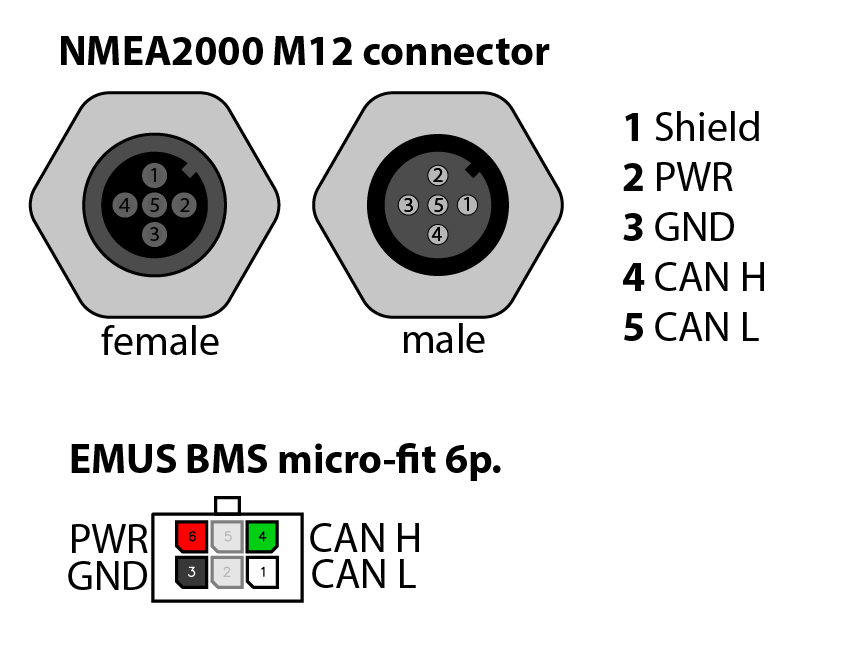

# STM32 CAN gateway

STM32F105 based dual CAN bus gateway / isolator.
Designed for a EMUS BMS CAN to NMEA2000 converter.
But hardware can be used for many CAN gateway or CAN isolation applications.

### Specs
```
- STM32F105RBT6 72MHz MCU with 2 internal CAN controllers
- CAN1 BMS (micro-fit 6-pin connector)
- CAN2 NMEA2000 isolated (M12 5-pin connector)
  or second micro-fit 6-pin connector
- 4-32V supply voltage
- RGB status LED
- USB-C for firmware updates
```
```
- Solder jumpers to use M12 male or female connectors.
- Solder jumpers for the CAN termination resistor.
- Solder jumpers for power output on CAN2 connector.
```


## pinout


